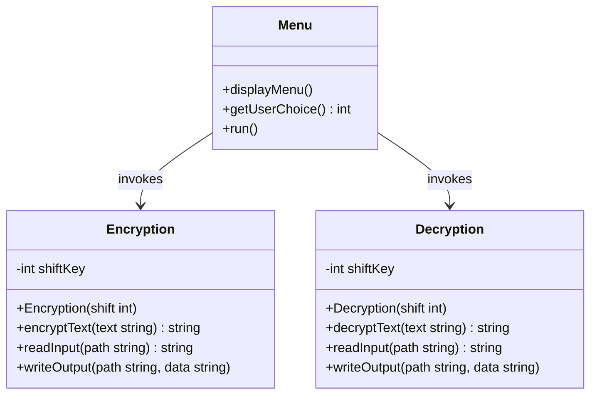
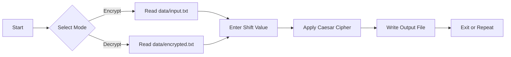

<div align="center">


<a href="https://github.com/h-hibaaah/CaesarCipherCLI">
  
</a>

<br/>

[](https://isocpp.org/)
[](#)
[](./LICENSE)
[](#)
[](#contributing)

<br/>

[](https://github.com/h-hibaaah/CaesarCipherCLI/stargazers)
[](https://github.com/h-hibaaah/CaesarCipherCLI/network/members)
[](https://github.com/h-hibaaah/CaesarCipherCLI/issues)

</div>

<br/>

<div align="center">

</div>

<br/>

<div align="center">
  <em>A command-line encryption tool built in C++ that implements the classic Caesar Cipher — engineered with clean Object-Oriented design, robust file handling, and a polished menu-driven interface.</em>
</div>

<br/>

<div align="center">

</div>

## Table of Contents

<table>
<tr>
<td width="50%" valign="top">

- [Overview](#overview)
- [Features](#features)
- [Technology Stack](#technology-stack)
- [Project Structure](#project-structure)
- [Getting Started](#getting-started)

</td>
<td width="50%" valign="top">

- [How It Works](#how-it-works)
- [Example Walkthrough](#example-walkthrough)
- [Concepts Demonstrated](#concepts-demonstrated)
- [Roadmap](#roadmap)
- [Author](#author)

</td>
</tr>
</table>

<div align="center">

</div>

## Overview

**Caesar Cipher CLI** is a lightweight, dependency-free C++ application for encrypting and decrypting text using the **Caesar Cipher** algorithm — one of the oldest and most well-known encryption techniques in cryptographic history.

The project is designed with production-style code organization in mind: separated headers and source files, dedicated classes for encryption and decryption logic, isolated I/O handling, and strict input validation — making it an excellent reference for anyone learning C++ project architecture.

<br/>

## Features

<table>
<tr>
<td width="33%" valign="top">

### Core Cryptography
- Caesar Cipher encryption engine
- Symmetric decryption using the same shift key
- Full alphabet wrap-around handling

</td>
<td width="33%" valign="top">

### File Handling
- Reads plaintext from `data/input.txt`
- Writes ciphertext to `data/encrypted.txt`
- Writes decrypted output to `data/decrypted.txt`

</td>
<td width="33%" valign="top">

### User Experience
- Clean, menu-driven CLI interface
- Input validation on menu choices and shift keys
- Modular, multi-file project layout

</td>
</tr>
</table>

<br/>

## Technology Stack

<div align="center">

| Technology | Purpose |
|:--:|:--|
|  | Core application logic |
|  | Encryption/decryption modeled as classes |
|  | Reading and writing cipher data |
|  | Version control |
|  | Hosting and collaboration |

</div>

<br/>

## Project Structure

```
CaesarCipherCLI/
│
├── include/
│   ├── encryption.h        # Encryption class declaration
│   ├── decryption.h        # Decryption class declaration
│   └── menu.h               # Menu / CLI interface declaration
│
├── src/
│   ├── encryption.cpp       # Encryption logic implementation
│   ├── decryption.cpp       # Decryption logic implementation
│   ├── menu.cpp              # Menu-driven interface implementation
│   └── main.cpp               # Application entry point
│
├── data/
│   ├── input.txt             # Source plaintext
│   ├── encrypted.txt         # Generated ciphertext
│   └── decrypted.txt         # Recovered plaintext
│
├── .gitignore
├── LICENSE
└── README.md
```

<br/>

### Class Architecture

<div align="center">



</div>

<br/>

## Getting Started

### Prerequisites

<div align="center">

 

</div>

### Compilation

```bash
g++ src/main.cpp src/menu.cpp src/encryption.cpp src/decryption.cpp -Iinclude -o CaesarCipher.exe
```

### Run

<table>
<tr>
<td><b>Linux / macOS</b></td>
<td>

```bash
./CaesarCipher.exe
```

</td>
</tr>
<tr>
<td><b>Windows</b></td>
<td>

```bash
CaesarCipher.exe
```

</td>
</tr>
</table>

<br/>

### Live Demo Preview

<div align="center">

<a href="https://github.com/h-hibaaah/CaesarCipherCLI">
  
</a>

</div>

<div align="center">

</div>

## How It Works

<div align="center">



</div>

1. Launch the application and choose an option from the menu — **Encrypt**, **Decrypt**, or **Exit**.
2. Enter a numeric shift value to define the cipher key.
3. The program reads source text from `data/input.txt`.
4. Encrypted output is written to `data/encrypted.txt`.
5. Decrypted output is written to `data/decrypted.txt`.

<br/>

## Example Walkthrough

<div align="center">

<table>
<tr>
<th>Stage</th>
<th>Value</th>
</tr>
<tr>
<td><b>Input</b></td>
<td><code>Hello World</code></td>
</tr>
<tr>
<td><b>Shift Key</b></td>
<td><code>3</code></td>
</tr>
<tr>
<td><b>Encrypted Output</b></td>
<td><code>Khoor Zruog</code></td>
</tr>
<tr>
<td><b>Decrypted Output</b></td>
<td><code>Hello World</code></td>
</tr>
</table>

</div>

<div align="center">

</div>

## Concepts Demonstrated

<div align="center">


</div>

<br/>

## Roadmap

<details>
<summary><b>Click to expand planned improvements</b></summary>
<br/>

- [ ] Encrypt custom user input directly from the terminal
- [ ] Generate random shift keys automatically
- [ ] Support additional cipher algorithms (Vigenère, ROT13, etc.)
- [ ] Maintain a persistent encryption/decryption history log
- [ ] Enhance the console UI with color output and formatting

</details>

<div align="center">

</div>

## Contributing

<div align="center">


Pull requests are welcome. For major changes, please open an issue first to discuss what you'd like to change.

<table>
<tr>
<td align="center" width="25%">
<br/><b>1. Fork</b>
</td>
<td align="center" width="25%">
<br/><b>2. Branch</b>
</td>
<td align="center" width="25%">
<br/><b>3. Commit</b>
</td>
<td align="center" width="25%">
<br/><b>4. Pull Request</b>
</td>
</tr>
</table>

</div>

<div align="center">

</div>

## Author

<div align="center">


<br/><br/>

**BS Computer Science Student**

[](https://github.com/h-hibaaah)

</div>

<br/>

---

<div align="center">

### If this project helped you, consider giving it a star

[](https://github.com/h-hibaaah/CaesarCipherCLI/stargazers)


</div>
